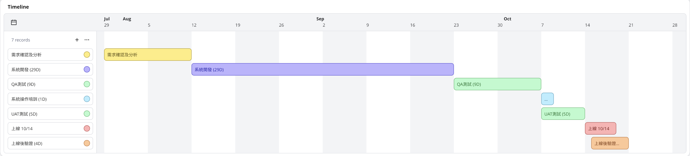

# RBAC授權機制

## 架構

以Role Based Accecc Control機制延生設計以下系統授權機制

<figure><figcaption></figcaption></figure>

說明

* 多租戶架構，跨租戶間數據不流通，不共享
* 當用戶有跨租戶管理需求，則需切換不同帳號
* 以下以單一租戶說明



* 用戶增加用戶組織>部門>子部門樹狀結構
* 一位用戶只屬於一個組織
* 一位用戶可能同時屬於組織內多個部門
* 當用戶組織階層多時，可支援用戶組綁角色。不多時，用戶直接綁角色比較有彈性。



* 暫時不考慮role分層(RBAC1)，若存在user階層關係，直接用不同role賦予權限上的階級差異即可
* role也區分組織，綁定用戶所屬組織



* 操作權限設定以功能目錄樹狀結構表示
* 每個功能(Resource)下支援操作(Operation)權限設定:增/刪/改/查等基本操作權限，保留可加入客製操作權限之彈性。e.g. 下載權限
* 作用於目錄內功能及按鈕顯示及訪問/操作權限



* 資料範圍可設定以客運業者>場站樹狀結構表示
* 若用戶組織=客運業者，則限制資料範圍僅能選擇該業者資料
* 套用於部分報表及功能作為資料權限區分
* 考慮部分部分報表及功能可能無法套用
* 考量不同維度設定資料範圍的需求



## 系統功能

組織管理

帳號管理

角色管理

角色權限管理

